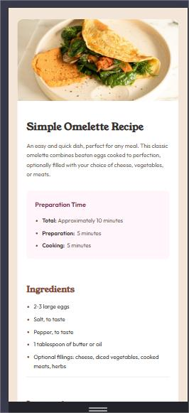

# Frontend Mentor - Recipe page solution

This is a solution to the [Recipe page challenge on Frontend Mentor](https://www.frontendmentor.io/challenges/recipe-page-KiTsR8QQKm). Frontend Mentor challenges help you improve your coding skills by building realistic projects. 

## Table of contents

- [Overview](#overview)
  - [The challenge](#the-challenge)
  - [Screenshot](#screenshot)
  - [Links](#links)
- [My process](#my-process)
  - [Built with](#built-with)
  - [What I learned](#what-i-learned)
  
- [Author](#author)


## Overview

### Screenshot




### Links

- Solution URL: [Add solution URL here](https://github.com/Bensolve/recipe-page-main)
- Live Site URL: [Add live site URL here](https://recipe-page-main-solve.netlify.app/)

## My process

### Built with

- Semantic HTML5 markup
- CSS custom properties
- Flexbox
- CSS Grid
- Mobile-first workflow


### What I learned

This project helped me grow and apply various front-end development skills, especially in responsive design, semantic HTML, and modern CSS techniques.

---

### ✅ Mobile-First Responsive Design

- Built the layout with a mobile-first approach.
- Used `clamp()`, `vw`, and media queries to create fluid spacing and scalable typography.
- Prioritized good hierarchy and readability across different screen sizes.

---

### ✅ Layout Breakouts & Image Handling

- Learned how to make an image break out of the container and stretch full width on mobile using:

  ```css
  width: 100vw;
  margin-left: calc(50% - 50vw);


## ✅ CSS Architecture & Naming Conventions

- Applied a BEM-like, component-focused naming convention for classes, such as:

  ```css
  .recipe__image
  .recipe__title
  .recipe__content


## ✅ Semantic HTML

- Used proper semantic elements:
  - `main`, `section`, `article` for structure.
  - `h1`, `h2`, `h3` for heading hierarchy.
  - `ul`, `ol`, and `table` for content lists and data.
- Improved accessibility and SEO by structuring content meaningfully.


## ✅ Modern Layout Techniques

- Used CSS Grid and Flexbox for layout spacing and alignment.
- Applied `gap`, `margin-block`, and `padding-inline` to manage rhythm and separation.
- Maintained consistent vertical spacing using `clamp()` for responsive design.


## ✅ Design Implementation from Mockups
- Accurately followed mobile and desktop design mockups.

- Matched padding, colors, font sizes, and spacing based on the style guide.


- Ensured the final product visually aligns with design expectations.


## ✅ Debugging & Iteration
- Fixed issues like:

- Image overflow on small screens.

- Unexpected right-side whitespace.

- Missing padding between sections.

- Reorganized structure when needed to make layout cleaner and more intuitive.


## Author


- Frontend Mentor - [@yourusername](https://www.frontendmentor.io/profile/Bensolve)
- Twitter - [@yourusername](https://x.com/Benjaminkissa1)
